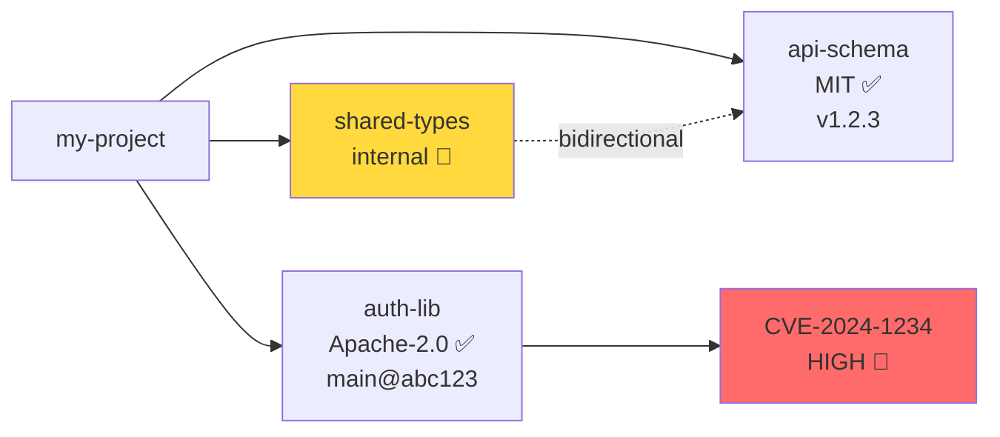

# 021: Dependency Graph Visualization

**Status:** Pending
**Priority:** P1 — Adoption driver
**Effort:** Medium (2-3 weeks)
**Dependencies:** 003 (Metadata Enrichment), lockfile v1.1+

## Problem

git-vendor tracks vendored dependencies with rich metadata (commit hashes, file hashes, licenses, drift scores, vulnerability data, internal vendor relationships), but provides no visual overview. Users managing 10+ vendors cannot quickly answer:

- What does my vendor dependency tree look like?
- Which vendors have vulnerabilities or drift?
- How do internal vendors (Spec 070) relate to external ones?
- What's the license distribution across my vendored code?

A dependency graph makes vendor relationships, health, and risk immediately visible.

## Solution

Add `git vendor graph` command that generates dependency graphs in multiple output formats from lockfile + audit data.

## Implementation

### Graph Data Model

Nodes and edges derive from existing types — no new data collection needed.

**Node types:**
| Type | Source | Label | Metadata |
|------|--------|-------|----------|
| `project` | Implicit (root) | Project name from git remote | - |
| `vendor` | `LockDetails` | `Name` | URL, License, Ref, CommitHash, VendoredAt |
| `file` | `LockDetails.FileHashes` | File path | SHA-256 hash |
| `vulnerability` | `ScanResult.Dependencies` | CVE ID | Severity, CVSS, Summary |

**Edge types:**
| Type | From → To | Metadata |
|------|-----------|----------|
| `vendors` | project → vendor | Group membership |
| `contains` | vendor → file | Hash |
| `internal_sync` | vendor(source) → vendor(dest) | Compliance mode, drift direction |
| `affected_by` | vendor → vulnerability | Severity, fix available |

### Output Formats

```bash
# Mermaid (default — renders in GitHub, GitLab, Notion)
git vendor graph
git vendor graph --format mermaid

# DOT (Graphviz)
git vendor graph --format dot

# JSON (machine-readable node/edge structure)
git vendor graph --format json

# Write to file
git vendor graph --output deps.mmd
git vendor graph --format dot --output deps.dot

# Filter by group
git vendor graph --group frontend

# Include vulnerability overlay
git vendor graph --include vulns

# Include file-level detail (large graphs)
git vendor graph --include files

# Include drift status
git vendor graph --include drift
```

### Mermaid Output Example



### JSON Output Schema

```json
{
  "schema_version": "1.0",
  "timestamp": "2026-02-11T...",
  "nodes": [
    {
      "id": "project",
      "type": "project",
      "label": "my-project"
    },
    {
      "id": "vendor:api-schema",
      "type": "vendor",
      "label": "api-schema",
      "metadata": {
        "url": "https://github.com/org/api",
        "license": "MIT",
        "ref": "v1.2.3",
        "commit": "abc123",
        "source": "",
        "drift_score": 12.5,
        "vuln_count": 0
      }
    }
  ],
  "edges": [
    {
      "from": "project",
      "to": "vendor:api-schema",
      "type": "vendors",
      "metadata": {
        "groups": ["backend"]
      }
    }
  ],
  "summary": {
    "total_vendors": 10,
    "external": 8,
    "internal": 2,
    "with_vulns": 1,
    "with_drift": 3
  }
}
```

### Files to Create/Modify

| File | Action | Purpose |
|------|--------|---------|
| `internal/core/graph_service.go` | Create | GraphService with BuildGraph(), RenderMermaid(), RenderDOT(), RenderJSON() |
| `internal/core/graph_service_test.go` | Create | Table-driven tests for each format |
| `internal/types/graph_types.go` | Create | GraphResult, GraphNode, GraphEdge, GraphSummary types |
| `internal/core/engine.go` | Modify | Add RunGraph() facade method |
| `internal/core/vendor_syncer.go` | Modify | Add RunGraph() delegation |
| `main.go` | Modify | Add `graph` subcommand with --format, --output, --include, --group flags |

### Key Code Patterns

GraphService reads lockfile + optional audit results (no new data fetching):

```go
type GraphService struct {
    lockStore LockStore
    configStore ConfigStore
    // Optional: inject audit/scan/drift services for overlay data
}

func (s *GraphService) BuildGraph(ctx context.Context, opts GraphOptions) (*types.GraphResult, error) {
    // 1. Load lockfile → vendor nodes + file nodes
    // 2. Load config → group edges, internal vendor edges
    // 3. If opts.IncludeVulns: load cached scan results
    // 4. If opts.IncludeDrift: load cached drift results
    // 5. Assemble nodes + edges
}

func (s *GraphService) RenderMermaid(result *types.GraphResult) string { ... }
func (s *GraphService) RenderDOT(result *types.GraphResult) string { ... }
```

### Testing Strategy

- Unit tests for each renderer (Mermaid, DOT, JSON) with golden file comparison
- Test empty lockfile → empty graph
- Test internal vendor edges (Spec 070 bidirectional)
- Test vulnerability overlay nodes/edges
- Test --group filtering
- Test --include files with 100+ files (performance)

## Risks & Mitigations

| Risk | Mitigation |
|------|------------|
| Large graphs (50+ vendors) unreadable in Mermaid | Default to vendor-only nodes; --include files opt-in. Mermaid subgraphs for groups |
| Stale audit data for overlays | Use cached results only; warn if cache older than 24h |
| No external dependencies needed | Mermaid/DOT are text formats — no library required for generation |

## References

- `internal/types/types.go` — VendorConfig, VendorLock, LockDetails
- `internal/types/scan_types.go` — ScanResult, DependencyScan, Vulnerability
- `internal/types/drift_types.go` — DriftResult, DriftDependency
- `internal/types/compliance_types.go` — ComplianceResult, ComplianceEntry
- `internal/core/sbom_generator.go` — CycloneDX/SPDX relationship patterns
- `internal/core/audit_service.go` — FormatAuditTable (table formatting reference)
